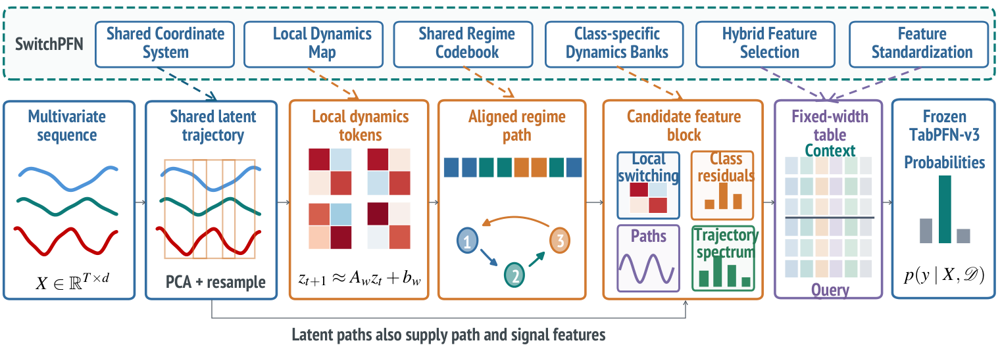

# SwitchPFN

**Shared Switching Dynamics for Frozen In-Context Time-Series Classification**

SwitchPFN converts multivariate time series into feature tables for a frozen
TabPFN-v3 classifier. It fits a shared coordinate system and a common regime
codebook, then describes each sequence through local dynamics, regime
transitions, class-specific prediction errors, and path summaries.

<p align="center">
  
</p>

The code includes the model and a classification runner for the UEA datasets.

## Model overview

The representation is fitted on the training split. Query sequences reuse the
fitted objects without updating them.

| Component | Implementation |
| --- | --- |
| Shared coordinates: interpolation, channel scaling, raw/difference PCA, resampling | `layers/dynamics.py` |
| Local affine dynamics, shared regimes, occupancy, dwell times, and lagged transitions | `layers/dynamics.py` |
| Class-specific dynamics banks and excluded-sequence training errors | `layers/dynamics.py` |
| Multiscale logsignatures and trajectory/spectral summaries | `layers/logsignature.py`, `layers/features.py` |
| Prefix/Fisher feature selection and feature standardization | `layers/features.py` |
| Frozen in-context prediction with complete selected-feature coverage | `layers/tabpfn.py` |

For a training context row, its contribution is removed from its own class bank
and the global fallback bank. A query uses the complete training banks. No neural
fine-tuning is performed.

## Getting started

Use Python 3.10-3.12. For Linux with CUDA 11.8:

```bash
python3.10 -m venv .venv
source .venv/bin/activate
pip install torch==2.6.0 --index-url https://download.pytorch.org/whl/cu118
pip install -r requirements.txt
```

For another device, use the appropriate wheel from the
[PyTorch installation instructions](https://pytorch.org/get-started/previous-versions/#v260).
The TabPFN adapter is pinned to `tabpfn==8.4.0`; the package version and the
TabPFN-v3 checkpoint version are different identifiers.

Obtain `tabpfn-v3-classifier-v3_default.ckpt` from the official
[TabPFN-v3 model repository](https://huggingface.co/Prior-Labs/tabpfn_3), following
its access instructions. Weights are not bundled here. Pass its local path with
`--checkpoint`; omitting that option delegates model retrieval to TabPFN.

### Prepare data

Place the official, non-timestamped UEA `.ts` files under `dataset/UEA`:

```text
dataset/UEA/
└── Heartbeat/
    ├── Heartbeat_TRAIN.ts
    └── Heartbeat_TEST.ts
```

The loader uses the supplied train/test split and fits the label encoder on
training labels only. It supports variable sequence lengths and missing values.
Datasets are available from the [UEA archive](https://www.timeseriesclassification.com/).

### Run classification

```bash
python run.py --dataset Heartbeat --data_root ./dataset/UEA \
  --checkpoint ./checkpoints/tabpfn-v3-classifier-v3_default.ckpt
```

Outputs are written to `results/Heartbeat/2027/`: `metrics.json` contains accuracy
and timing, and `predictions.npz` contains labels, probabilities, and their class
order. Reusing the same dataset/seed/output path replaces those two result files.

### Python interface

```python
from models.SwitchPFN import Model

# Each list element is a NumPy array with shape [time, channels].
model = Model(checkpoint="checkpoints/tabpfn-v3-classifier-v3_default.ckpt")
model.fit(X_train, y_train)
prediction = model.predict(X_test)
probabilities = model.predict_proba(X_test)  # columns follow model.classes_
```

`model.context_features_` contains the training context used by TabPFN.
`model.transform(X)` returns query features, including when `X` contains training
sequences; it does not recreate the excluded-bank context rows.

## Repository structure

```text
SwitchPFN/
├── models/              # Model interface and one default configuration
├── layers/              # Dynamics, feature construction, logsignatures, TabPFN
├── data_provider/       # UEA train/test loader
├── scripts/             # Short classification command
├── pic/                 # Framework from the manuscript
├── tests/               # Numerical and data-flow checks; no model weights needed
├── run.py
├── requirements.txt
└── README.md
```

Default settings are in `models/config.py`.

## Checks

```bash
python -m unittest discover -s tests -v
```

The tests cover feature construction, leave-one-out banks, query transforms,
logsignature identities, and data loading. Backend tests use a stub and do not
load model weights. See [VALIDATION.md](VALIDATION.md) for numerical comparisons
with the reference implementation.

## Acknowledgments

The repository organization follows [TimesNet](https://github.com/thuml/TimesNet)
and its [Time-Series-Library](https://github.com/thuml/Time-Series-Library), with
separate model, layer, and data modules. The predictor is provided by
[PriorLabs/TabPFN](https://github.com/PriorLabs/TabPFN). Third-party packages and
model weights retain their respective licenses and terms.
